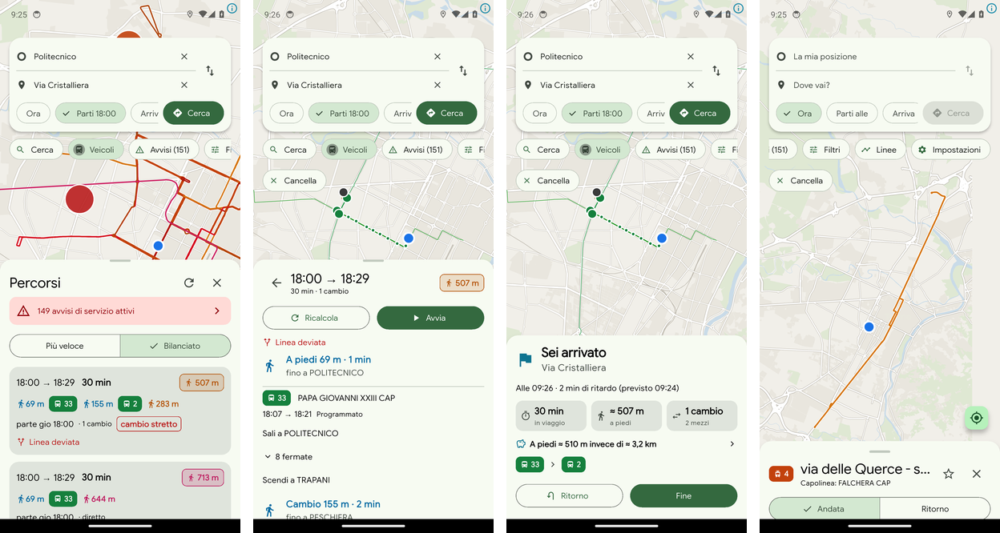

<p align="center">
  
</p>

<h1 align="center">PiedeMove</h1>

<p align="center">
  <b>Turin's public-transport planner for university students who ride for free.</b><br>
  Fewer steps, not fewer minutes.
</p>

<p align="center">
  <a href="https://github.com/LucaCraft89/piedemove/releases"></a>
  <a href="https://github.com/LucaCraft89/piedemove/actions/workflows/ci.yml"></a>
  
  
  <a href="LICENSE"></a>
</p>

<p align="center">
  
</p>

---

## The idea

University students in Turin travel on GTT for free with the **PieMove
card**: every ride costs nothing, so the only real price of a trip is the
**walking**. Mainstream planners optimise for minutes and happily send you on
a 600 m walk to save two of them.

PiedeMove turns that around:

- it lists **every line** that can make each hop, not just the one the router
  happened to pick;
- it **invents short footpath transfers** between nearby stops that GTT's data
  never mentions, so a 120 m walk across a square can join two lines;
- it **trades waiting and changes for less walking**, and tells you exactly how
  much you walk on each leg.

> **Politecnico → Via Cristalliera.** The usual answer is "take the 33 or the
> 42, then walk". PiedeMove finds a short hop from TRAPANI to PESCHIERA and the
> **2** to BARDONECCHIA, a few steps from the door. That trip is the project's
> golden test and runs on every commit.

Bus, tram, metro and funicular. No fares, no cars, no bikes,
no walking-only trips: it does one thing.

## What it does

**Plans for your feet**
- Balanced and fastest orderings, a walking cap, your own walking speed, and a
  filter per mode.
- One badge per hop with every usable line (`10 · 16 · 42`), not one result
  per line.
- Stops as places: pick a stop and the planner boards on whichever side of the
  street the trip needs.
- Walking legs drawn on real OpenStreetMap footpaths, the distance marked "≈"
  whenever it is an estimate.

**Rides with you**
- A live trip with "get off at the next stop" and "get off now" in strong,
  long vibrations, working with the screen off.
- A notification with the next instruction, a progress bar and **Sono salito /
  Sono sceso / Termina** buttons on the lock screen.
- **"Hai perso il 2?"** when your bus leaves without you, **"Affrettati"**
  when you will not make it at your pace, and **"Coincidenza a rischio"**
  from the bus when a delay is about to break your change.
- On the metro, where phone GPS is useless, progress follows the timetable and
  the live delay instead.
- An arrival screen with time, walking, changes and the walking you saved.

**Knows what is happening**
- GTT's live vehicle positions, delays, cancellations and service alerts,
  polled straight from GTT's GTFS-realtime feeds.
- A strike banner with the guaranteed service bands, and alerts that survive
  an outage of GTT's alert service.
- A clear chip naming whichever live feed is down; planning keeps working on
  the timetable without any of them.

**Fits your day**
- Casa / Lavoro one tap away, a live departure board for favourite stops and a
  home-screen widget.
- An offline map of the whole GTT area.
- "I tuoi viaggi": trips, walking and walking spared, month by month.

## Private by design

Everything runs **on the phone**. There is no backend, no account, no
analytics and no Google data: the timetable index is built on the device from
GTT's open data, places come from Photon (OpenStreetMap), and the map from
OpenFreeMap. Trips, favourites and statistics never leave the phone. The
"Segnala un problema" report opens a GitHub issue only when you tap it, with
positions stripped out.

## Install

1. Download the latest `piedemove-<version>.apk` from
   **[Releases](https://github.com/LucaCraft89/piedemove/releases)**.
2. Open it and allow installing from this source.
3. New versions are offered inside the app (*Nuova versione · Scarica*) and
   install over the old one, keeping favourites and settings.

Every APK ships with a `.sha256` file. Releases are signed with one key since
beta 9; its certificate fingerprint is in
[`android/release-cert-sha256.txt`](android/release-cert-sha256.txt)
(`apksigner verify --print-certs piedemove-<version>.apk`).

## How it works

| Piece | What it does |
|---|---|
| `lib/data` | Streams GTT's GTFS zip into a compact binary index (stops, patterns, trips, service days) built and cached on the phone. |
| `lib/routing` | rRAPTOR over that index, an every-line pass that collects all lines per hop, generated footpaths, and a "balanced" score where walking is the cost. |
| `lib/realtime` | A small GTFS-realtime decoder and store: vehicles, delays, cancellations, skipped stops and alerts, each feed isolated and health-checked. |
| `lib/geo` | Line geometry matched to OpenStreetMap roads with an HMM over the GTFS shapes, plus a pedestrian graph for walking paths. |
| `lib/location` | The live trip engine: progress, boarding and alighting rules, cues, notification, metro mode, trip log. |
| `lib/ui` | Riverpod state, MapLibre map, one sheet system for stops, lines, vehicles and alerts. |

**Continuous integration** runs on every push: static analysis, 300+ unit and
widget tests, the golden trip on today's real GTT timetable, a probe of GTT's
live feeds, a release-key check and a full **tour of the app on an Android
emulator** with screenshots. Line geometry is rebuilt daily and the walking
graph weekly, and the app downloads them on its own. A merge titled
`[release]` publishes the signed APK.

## Build from source

```sh
flutter pub get
flutter analyze && flutter test
dart tool/build_index.dart      # GTFS -> build/index.bin (golden tests use it)
flutter build apk --release
```

Release signing reads `android/key.properties` or the `PM_KEYSTORE*`
environment variables and falls back to the debug key with a warning.

## Honest about the data

- GTT publishes no transfers file, so footpaths between stops are estimated
  and marked as such.
- GTT's realtime has no trip id on vehicles and no metro positions; the app
  matches buses by line, heading and position, and runs the metro on the
  timetable plus delay.
- OpenStreetMap footpaths and crossings vary in quality; approximate walking
  is always shown with "≈".
- The regional (Regione Piemonte) feed is schedule-only.

## Licences and attribution

The **code** is MIT ([`LICENSE`](LICENSE)). The **data** is not; see
[`NOTICE.md`](NOTICE.md). In short:

- Timetables and realtime: **GTT S.p.A. - Gruppo Torinese Trasporti**, for
  non-commercial use with attribution. PiedeMove is and stays free, ad-free
  and non-commercial.
- Regional lines: Regione Piemonte, CC BY 4.0.
- Maps, line geometry and footpaths: © OpenStreetMap contributors, ODbL;
  basemap by OpenFreeMap / OpenMapTiles.

PiedeMove is an independent project, not affiliated with GTT.

## Feedback

Found a wrong route, a missed stop or a strange live trip? In the app:
**Impostazioni → Segnala un problema**, or open an
[issue](https://github.com/LucaCraft89/piedemove/issues) with origin,
destination, time and a screenshot.
